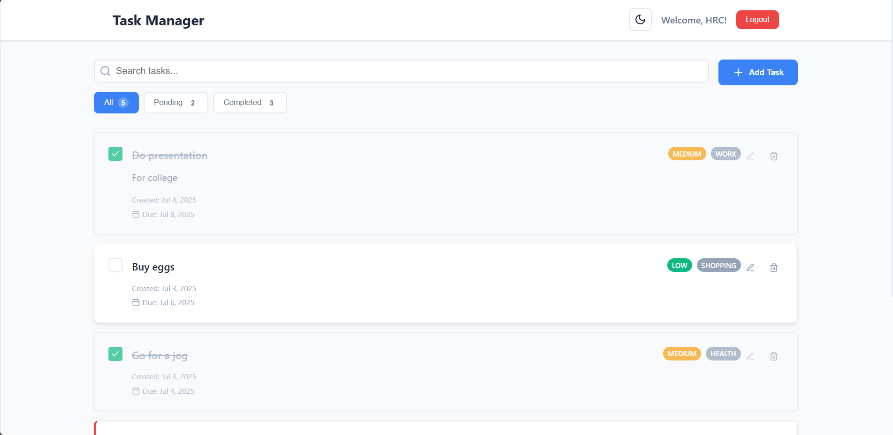
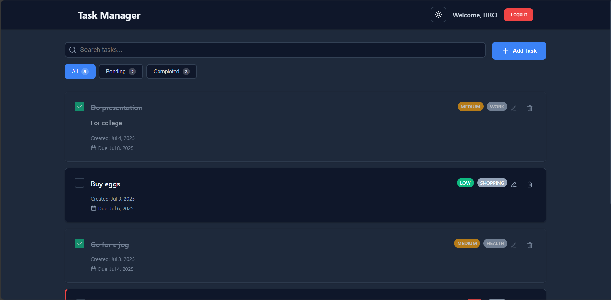
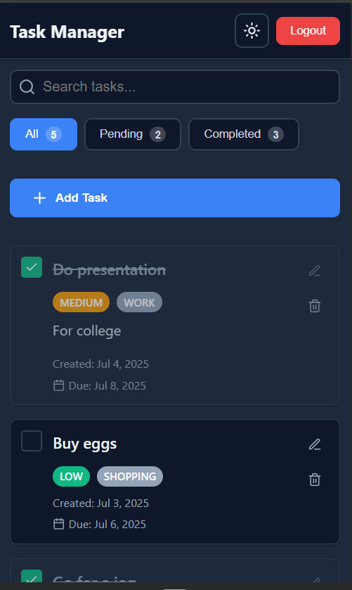

# Personal Task Tracker

## 📖 Description
A sleek and modern task management application built with React that helps you stay organized and productive. Features a clean interface with dark mode support, task filtering, priority levels, and persistent data storage. Perfect for managing daily tasks, work assignments, and personal projects.

## 🚀 Features
- **Simple Authentication** - Username-based login with session persistence
- **Task Management** - Create, edit, delete, and toggle task completion
- **Smart Filtering** - Filter tasks by All, Completed, or Pending status
- **Real-time Search** - Search tasks by title or description
- **Priority Levels** - Organize tasks with High, Medium, and Low priority badges
- **Categories** - Categorize tasks (Work, Personal, Shopping, Health, Other)
- **Due Dates** - Set due dates with overdue indicators
- **Dark Mode** - Toggle between light and dark themes
- **Responsive Design** - Fully responsive layout for mobile and desktop
- **Data Persistence** - Tasks persist using localStorage
- **Smooth Animations** - Polished UI with smooth transitions and hover effects
- **Task Statistics** - Live count of tasks in each filter category
- **Confirmation Dialogs** - Safe task deletion with confirmation prompts

## 🛠 Setup Instructions
1. Clone the repository
   ```bash
   git clone https://github.com/Hrittik20/Task-Manager
   cd personal-task-tracker
   ```
2. Install dependencies
   ```bash
   npm install
   ```
3. Start the development server
   ```bash
   npm start
   ```
4. Open [http://localhost:3000](http://localhost:3000) in your browser

## 🧰 Technologies Used
- **React.js** - Frontend framework with hooks (useState, useEffect)
- **Lucide React** - Beautiful icon library

## 🎯 Usage
1. **Login** - Enter any username to access your task dashboard
2. **Add Tasks** - Click "Add Task" to create new tasks with title, description, priority, category, and due date
3. **Manage Tasks** - Edit, delete, or mark tasks as complete
4. **Filter & Search** - Use the filter tabs and search bar to find specific tasks
5. **Theme Toggle** - Switch between light and dark mode using the theme toggle button

## 🔗 Live Demo
[Link to deployed application](https://task-manager-f98thqlcp-hrittiks-projects-9bda8799.vercel.app/)

## 🖼 Screenshots

### Light Mode Dashboard

*Clean and modern interface with task filtering and search functionality*

### Dark Mode with Task Form

*Elegant dark theme with comprehensive task creation form*

### Mobile Responsive View

*Fully responsive design optimized for mobile devices*